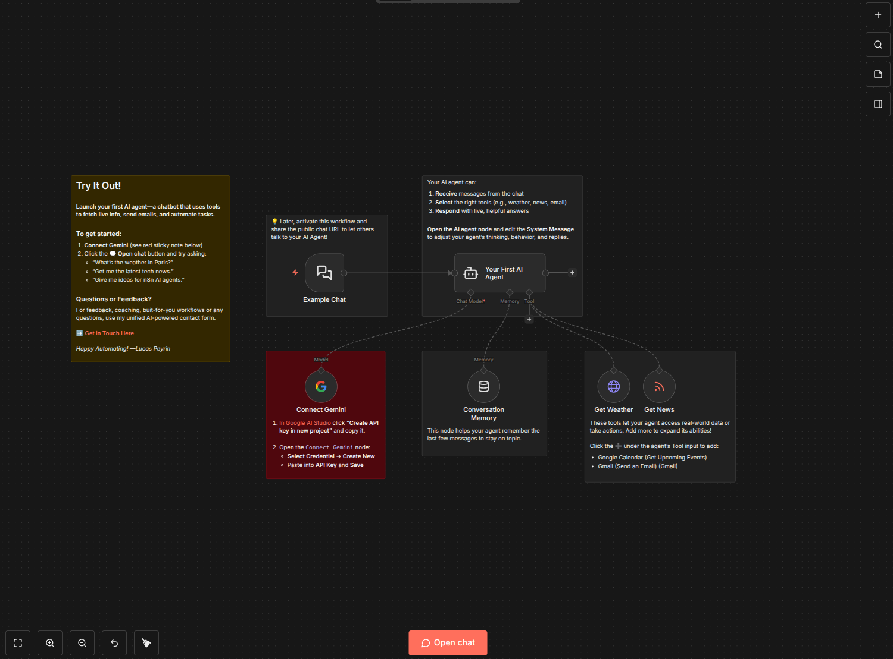
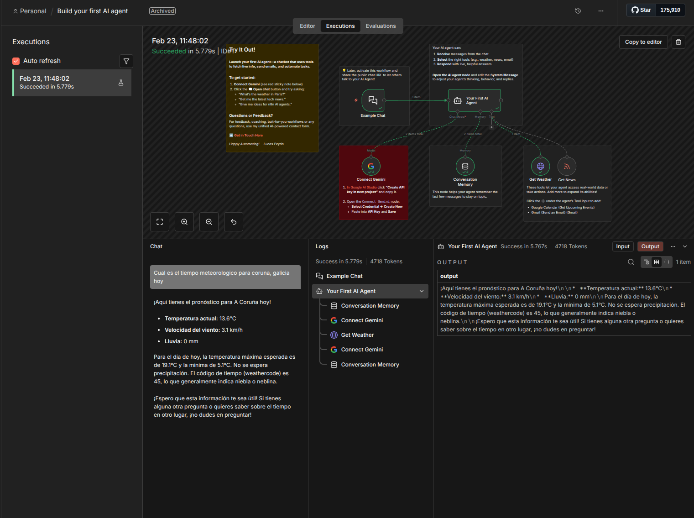
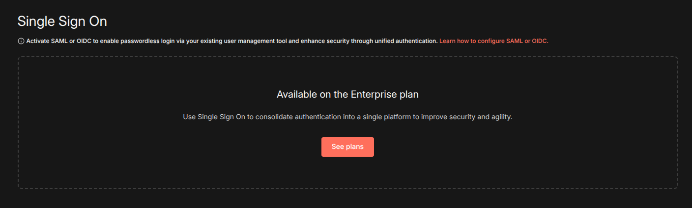
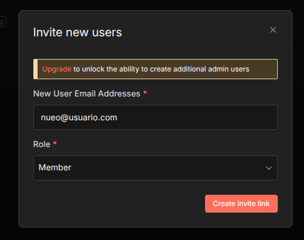
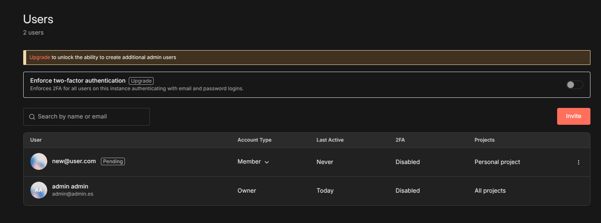
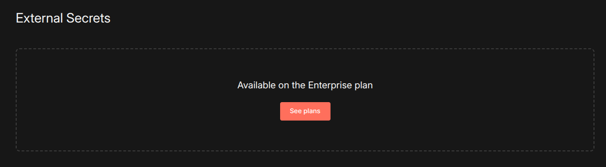
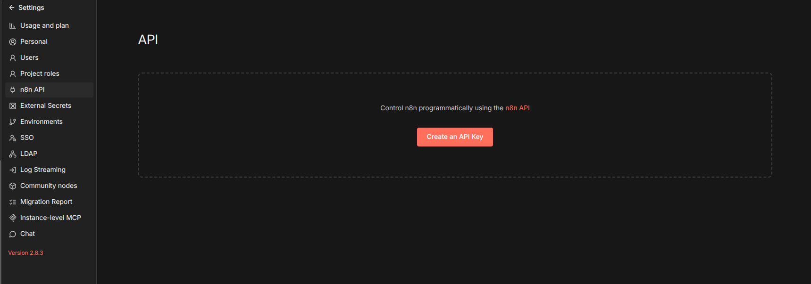
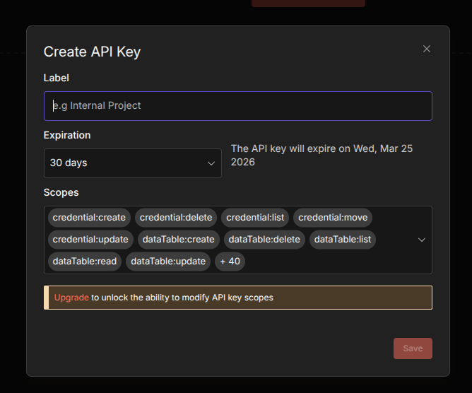
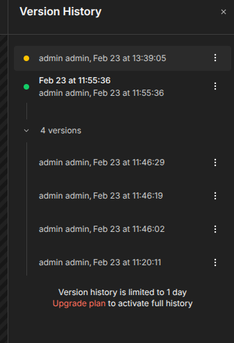
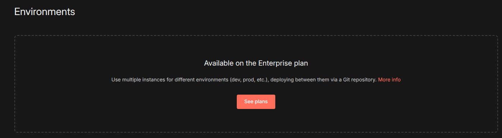

# n8n

## Índice

* [Resumen](#resumen)
* [Tabla actualizada](#tabla-actualizada)
* [Pruebas realizadas sobre la instancia de n8n](#pruebas-realizadas-sobre-la-instancia-de-n8n)


* [Pruebas](#pruebas)
  * [Editor visual](#editor-visual)
  * [Multi-tenant](#multi-tenant)
  * [Usuarios/roles externos](#usuariosroles-externos)
  * [Secretos por tenant](#secretos-por-tenant)
  * [APIs de ejecución y gestión](#apis-de-ejecuci%C3%B3n-y-gesti%C3%B3n)
  * [Observabilidad y trazabilidad](#observabilidad-y-trazabilidad)
  * [Listado de operaciones disponibles en el API vinculadas a los dos puntos anteriores](#listado-de-operaciones-disponibles-en-el-api-vinculadas-a-los-dos-puntos-anteriores)


* [Información adicional](#informaci%C3%B3n-adicional)
  * [Control de versiones](#control-de-versiones)

---

## Resumen

Tras la batería de pruebas realizadas se mantienen las mismsas conclusiones tras el análisis preliminar. Faclidida de uso, interfaz visual y configuración del entorno muy visual y sencilla. La creación de flujos de trabajo, importación de otros y modificación no resulta compleja, siendo la barrera técnica exigida para su uso baja.

Existen demasiadas funcionalidades que no están disponibles en la versión grautita en la cual se fundamentan estas pruebas. Debido a esto gran parte de los requisitos no acompañan un ejemplo de uso según se requiere.

La mayoría de las funcionalidades limitadas están relacionadas con la gestión de usuarios/roles, SSO/OIDC... Debido a ello no se ha podido determinar si existe un mecanismo que permita crear plantillas de flujos de trabajo y limitarlas a determinados tenants.

### Tabla actualizada

A continuación se presenta la evaluación detallada de la herramienta tomando en cuenta las pruebas realizadas.

| Requisitos funcionales | Free plan | Enterprise |
|------------------------|--------|-------|
| Edición visual de flujos | SI | SI |
| Plantillas reutilizables y parametrización | SI | SI |
| Definición de agentes reutilizables por múltiples tenants | - | - |
| Nodos prefabricados: control de flujo y conectores típicos | SI | SI |
| Importación/exportación “flow-as-code”; compatibilidad o integración con LangGraph* | JSON | JSON |
| Integración con herramientas / datos   | SI | SI |
| Acceso a herramientas mediante MCPs (ej.: IBM ContextForge MCP Gateway u otros) | SI | SI |
| Posibilidad de encapsular herramientas propias como nodos/acciones | SI | SI |
| **Observabilidad y operaciones**  |
| Métricas, logs estructurados y trazas por ejecución | SI | SI |
| APIs para consultar observabilidad y trazabilidad | SI | SI |
| Gestión del ciclo de vida del flujo: publicación, versionado, rollback, ejecución, re-ejecución | SI | SI |
| Pruebas de flujos (sandbox / entornos de prueba) | SI | SI |
| **Gobierno y seguridad** |
| Soporte multi-tenant (nativo o por diseño de despliegue) | NO | SI |
| Usuarios/roles externos (SSO/OIDC/SAML si aplica; RBAC) | NO | SI |
| Aislamiento y scoping de credenciales/secretos por tenant | NO | SI |

No hay compatibilidad nativa con LangGraph

### Pruebas realizadas sobre la isntancia de n8n

| Tarea | Estado | Observaciones |
|-------|------------|--------|
| Editor visual | SI | |  
| Multi-tenant | - | Disponible en modo *enterprise* |  
| Usuarios/roles externos | Limitado | SSO/OIDC/SAML limitado a versión *enterprise* |  
| Secretos por tenant | - | Disponible en modo *enterprise*  |  
| APIs de ejecución y gestión | SI |  |  
| Observabilidad y trazabilidad | SI |  |  

## Pruebas

### Editor visual

Se adjunta captura de pantalla del flujo y [video de ejemplo](https://youtu.be/gxihRGlBKyI) con la ejecución de un flujo básico empleando un Agente. En este [video puede verse una muestra de la gestion de las credenciales](https://youtu.be/gJ0nui_zoQo).





### Multi-tenant

No se ha podido probar por ser una de las características exclusivas de la versión enterprise.



### Usuarios/roles externos

En la versión gratuita limitado a creación de usuarios de con único rol por defecto. Limitado a un único administrador. En el [siguiente video puede](https://youtu.be/YeZN0uBb530) verse una pequeña muestra.




### Secretos por tenant

No se ha podido probar por ser una de las características exclusivas de la versión enterprise.



### APIs de ejecución y gestión

Requiere la generación de un API-KEY para realizar las consultas (proceso sencillo e intuitivo).  

Ejemplo de consulta para recuperación de los workflows.

```bash
curl -X 'GET' \
  'http://localhost:5678/api/v1/executions?includeData=false&workflowId=1000&projectId=Cr0GkhBfEYYTdVUC&limit=100' \
  -H 'accept: application/json' \
  -H 'X-N8N-API-KEY: <YOUR-API-KEY>'
```

```json
{
  "data": [
    {
      "id": 1000,
      "data": {},
      "finished": true,
      "mode": "cli",
      "retryOf": 0,
      "retrySuccessId": 2,
      "startedAt": "2026-02-23T11:05:35.829Z",
      "stoppedAt": "2026-02-23T11:05:35.829Z",
      "workflowId": 1000,
      "waitTill": "2026-02-23T11:05:35.829Z",
      "customData": {},
      "status": "canceled"
    }
  ],
  "nextCursor": "MTIzZTQ1NjctZTg5Yi0xMmQzLWE0NTYtNDI2NjE0MTc0MDA"
}
```

Los resultado de ejecución tambien pueden ser consultados visualmente.

### Observabilidad y trazabilidad

Para un acceso rápido al API se dispone de un swagger que facilita la generación visual de consultas. El listado completo puede encontrarse detalladamente [en la documentación oficial](https://docs.n8n.io/api/api-reference/#tag/execution). En la versión desplegada a partir del docker compose no estan disponibles los endpoints para pararda de ejecuciones y modifiación de TAGS.

En el [siguiente video](https://youtu.be/dW9umBzh8Xw) puede verse el flujo de un solicitud junto con una peticion API para recuperar las ejecuciones y un intento de reejecución.




### Listado de operaciones disponibles en el API vinculadas a los dos puntos anteriores.

El elenco de operaciones disponiblesque afectan

<span style="color:#0082D1;">GET</span> /executions  
<span style="color:#0082D1;">GET</span> /executions/{id}  
<span style="color:#EF0006;">DELETE</span> /executions/{id}  
<span style="color:#079082;">POST</span> /executions/{id}/retry  
<span style="color:#079082;">POST</span> /executions/{id}/stop  
<span style="color:#079082;">POST</span> /executions/stop  
<span style="color:#0082D1;">GET</span> /executions/{id}/tags  
<span style="color:#FF6605;">PUT</span> /executions/{id}/tags  

<span style="color:#079082;">POST</span> /workflows  
<span style="color:#0082D1;">GET</span> /workflows  
<span style="color:#0082D1;">GET</span> /workflows/{id}  
<span style="color:#EF0006;">DELETE</span> /workflows/{id}  
<span style="color:#FF6605;">PUT</span> /workflows/{id}  
<span style="color:#0082D1;">GET</span> /workflows/{id}/{versionId}  
<span style="color:#079082;">POST</span> /workflows/{id}/activate  
<span style="color:#079082;">POST</span> /workflows/{id}/deactivate  
<span style="color:#FF6605;">PUT</span> /workflows/{id}/transfer  
<span style="color:#0082D1;">GET</span> /workflows/{id}/tags  
<span style="color:#FF6605;">PUT</span> /workflows/{id}/tags 

## Información adicional

A continaución se detalla cierta información obtenida tras la realización del despliegue y las pertinentes pruebas. La cual puede ser de interés para una valoración final de la herramienta.

## Control de versiones

Existen dos ámbitos en los cuales se puede aplicar el control de versiones. Uno encuadra a los diferentes *workflows*  y el otro a los *entornos*.

El control de versiones de los *workflows* se basa en le histórico de cambios realizados sobre estos. Es automático y no requiere intervención para su gestión. Permite recuperar versiones anteriores, visualizarlas, clonarlas, probarlas y exportarlas. Se trata de una funcionalidad a nivel de *workflows*  y no a nivel de nodo.



En cuanto al versionado de variables de entorno se basa en su integración con git. Dado que dicha funcionalidad está limaitada a la versión enterprise no se ha podido determinar si existe algún modo de vincular versiones de entorno con versiones de workflow.


