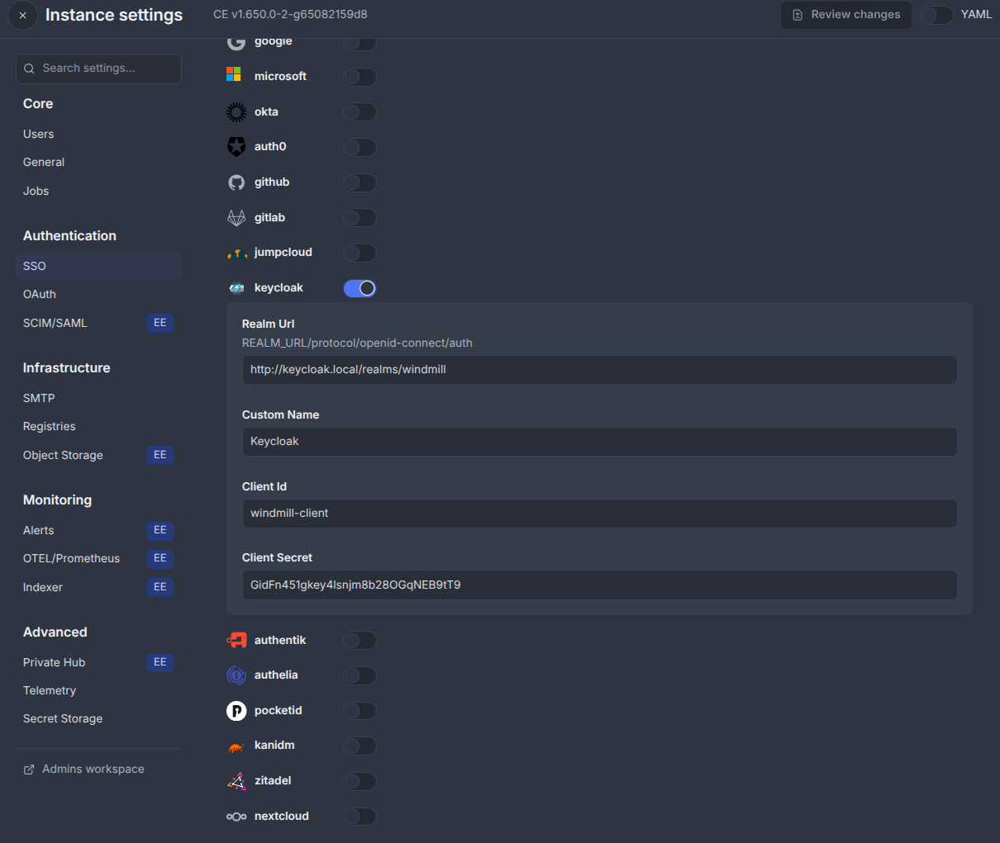
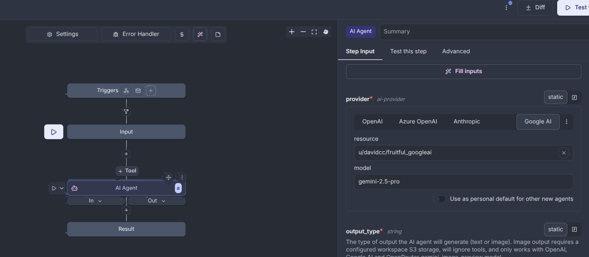

# Windmill

## Configuración keycloak

1. El despligue incluye un proxy inverso que emplea el alias keycloak.local para direccionar las peticiones. Por lo tanto es necesario añadir dicha entrada en el /etc/hosts

```shell
127.0.0.1 keycloak.local
```

2. Se proporciona una configuración básica con el realm, cliente preconfigurados y un usario de ejemplo con los siguientes datos.

* User: user1@example.com
* Password: hello

## Arranque

```bash
docker compose up -d
```

## Configuraón SSO en Windmill

* Realm Url: http://keycloak.local/realms/windmill
* Client Id: windmill-client
* Client Secret: GidFn451gkey4lsnjm8b28OGqNEB9tT9



## Configuración API Key del ejemplo

El ejemplo realizado utiliza un API Key de Google AI Studio. Se puede solicitar una cuenta gratuita que proporciona 20 consultas al día.

[Ejemplo configuracion API Key](https://youtu.be/8MyeYOs0F30)

En el ejemplo de flujo aportado el secreto esta preconfigurado con el siguiente nombre. En base al usuario creado esto puede variar. Para ello puede editarse el ficher aportado o mediante la interfaz gráfica en el nodo AI Agent seleccionando un campo en resoruce dentro de **provider**.

```yaml
resource: $res:u/davidcc/fruitful_googleai
```


