# n8n

## Índice

* [Resumen](#Resumen)
* [Tabla actualizada](#tabla-actualizada)
* [Pruebas realizadas sobre la instancia de n8n](#pruebas-realizadas-sobre-la-instancia)


* [Pruebas](#pruebas)
  * [Editor visual](#editor-visual)
  * [Multi-tenant](#multi-tenant)
  * [Usuarios/roles externos](#usuariosroles-externos)
  * [Secretos por tenant](#secretos-por-tenant)
  * [APIs de ejecución y gestión](#apis-de-ejecuci%C3%B3n-y-gesti%C3%B3n)
  * [Observabilidad y trazabilidad](#observabilidad-y-trazabilidad)
  * [Listado de operaciones disponibles en el API vinculadas a los dos puntos anteriores](#listado-de-operaciones-disponibles-en-el-api-vinculadas-a-los-dos-puntos-anteriores)


* [Información adicional](#informaci%C3%B3n-adicional)
  * [Control de versiones](#control-de-versiones)

---

## Resumen


### Tabla actualizada

A continuación se presenta la evaluación detallada de la herramienta tomando en cuenta las pruebas realizadas.

| Requisitos funcionales | Free plan | Enterprise |
|------------------------|--------|-------|
| Edición visual de flujos | SI | SI |
| Plantillas reutilizables y parametrización | SI | SI |
| Definición de agentes reutilizables por múltiples tenants | SI* | SI* |
| Nodos prefabricados: control de flujo y conectores típicos | SI | SI |
| Importación/exportación “flow-as-code”; compatibilidad o integración con LangGraph* | YAML/JSON | YAML/JSON |
| Integración con herramientas / datos   | SI | SI |
| Acceso a herramientas mediante MCPs (ej.: IBM ContextForge MCP Gateway u otros) | SI | SI |
| Posibilidad de encapsular herramientas propias como nodos/acciones | SI | SI |
| **Observabilidad y operaciones**  |
| Métricas, logs estructurados y trazas por ejecución | Limitado | SI |
| APIs para consultar observabilidad y trazabilidad | SI | SI |
| Gestión del ciclo de vida del flujo: publicación, versionado, rollback, ejecución, re-ejecución | SI | SI |
| Pruebas de flujos (sandbox / entornos de prueba) | SI | SI |
| **Gobierno y seguridad** |
| Soporte multi-tenant (nativo o por diseño de despliegue) | SI | SI |
| Usuarios/roles externos (SSO/OIDC/SAML si aplica; RBAC) | SSO/OAUTH | SI |
| Aislamiento y scoping de credenciales/secretos por tenant | SI* | SI* |

No hay compatibilidad nativa con LangGraph
Aislamiento a nivel lógico, no a nivel físico

### Pruebas realizadas sobre la instancia

| Tarea | Estado | Observaciones |
|-------|------------|--------|
| Editor visual | SI | |  
| Multi-tenant | SI | SI |  
| Usuarios/roles externos | SSO/OAuth | SCIM/SAML limitado a versión *enterprise* |  
| Secretos por tenant | SI | SI |  
| APIs de ejecución y gestión | SI |  |  
| Observabilidad y trazabilidad | SI |  |  

## Pruebas

### Editor visual

Se adjunta captura de pantalla del flujo y [video de ejemplo](https://youtu.be/efsy9uBcK58) con la creación y ejecución de un flujo básico empleando un Agente. 

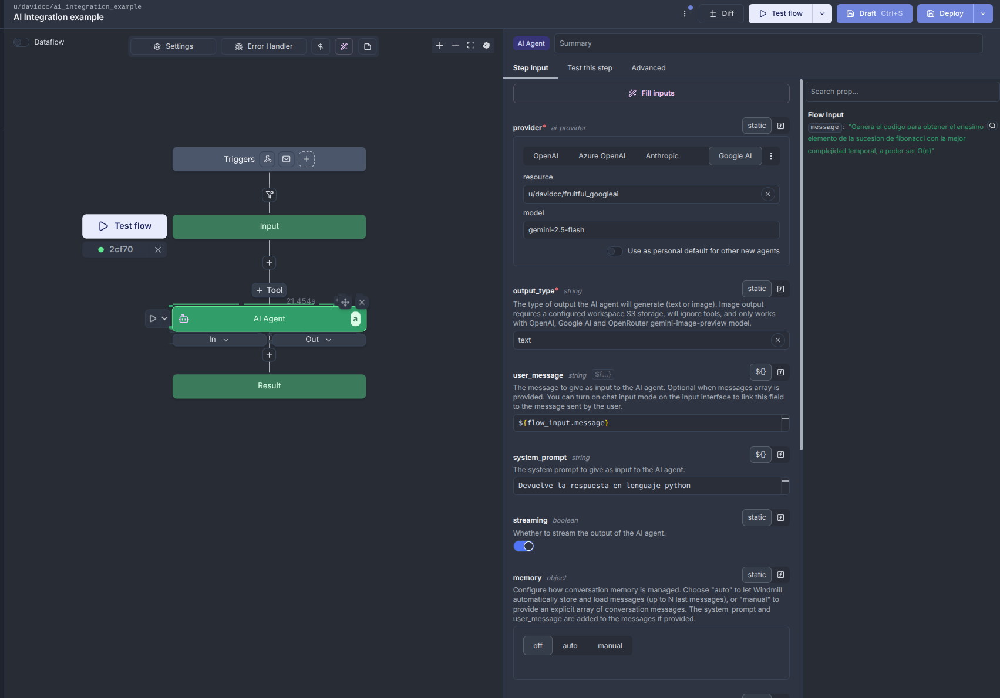

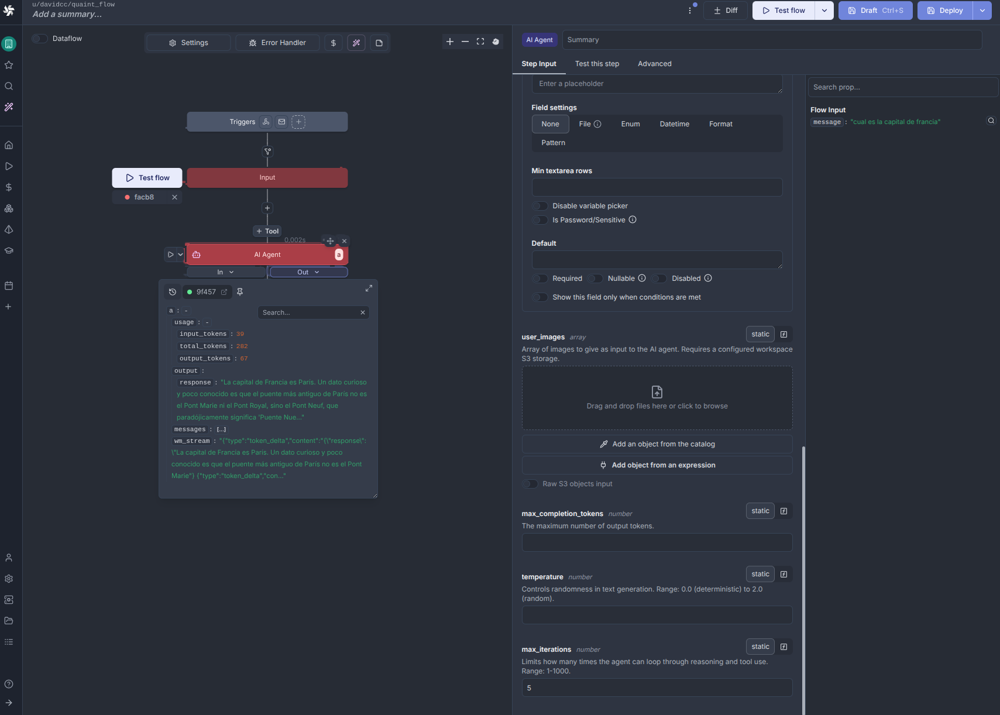

### Multi-tenant

En *Windmill* Multi-tenant se basa en el concepto de *workspace*, que se comportan como entornos aislados dentro de una misma instancia de *Windmill*. Cada uno gestionando de modo independiente usuarios, flujos de trabajo, apps o recursos como API keys. 

A nivel de capa de almacenamiento, la configuración del workspace, usuarios, roles, flujos y demás no son independientes. Todos residen en la misma instancia de almacenamiento. 

Si fuese requerida una mayor independencia la única alternativa es desplegar instancias independientes, de este modo se esegura un aislamiento y control total, brindando la posibilidad al "propietario" de gestionar diversos *workspaces* dentro de su propia organnizacion.

### Usuarios/roles externos

La versión self hosted gratuita no presenta problemas tras la configuración de *keycloak* como proveedor SSO. En el siguiente enlace puede verse un [ejemplo de login mediante *keycloak*](https://youtu.be/AZHa104zkBg). La gestión de roles está limitada a nivel interno, tras la primera atenticación y la creación automática del usuario en la instancia, el administrador debe asignar los roles específicos a nivel de instancia y workspace.

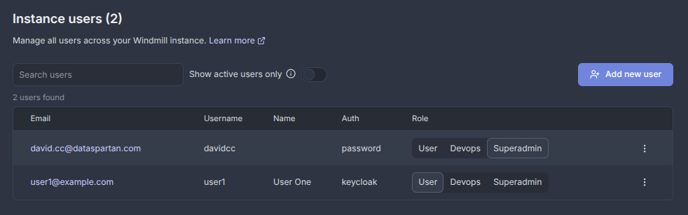

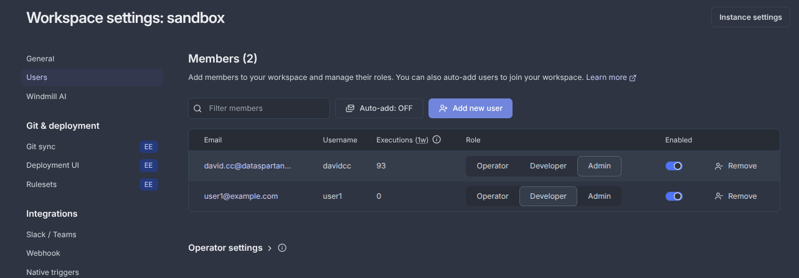

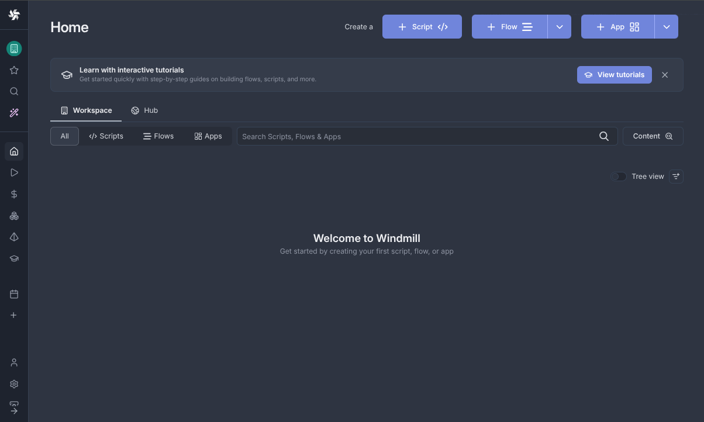

Ejemplo fichero de configuración del proveedor SSO en *Windmill*.

```yaml
base_url: http://localhost
custom_instance_pg_databases:
  user_pwd: __SENSITIVE_AND_UNCHANGED__
custom_tags:
  - chromium
jwt_secret: __SENSITIVE_AND_UNCHANGED__
oauths:
  keycloak:
    id: windmill-client
    secret: __SENSITIVE_AND_UNCHANGED__
    display_name: Windmill
    connect_config:
      auth_url: http://keycloak.local/realms/windmill/protocol/openid-connect/auth
      token_url: http://keycloak.local/realms/windmill/protocol/openid-connect/token
      scopes:
        - openid
        - offline_access
    login_config:
      auth_url: http://keycloak.local/realms/windmill/protocol/openid-connect/auth
      token_url: http://keycloak.local/realms/windmill/protocol/openid-connect/token
      userinfo_url: http://keycloak.local/realms/windmill/protocol/openid-connect/userinfo
      scopes:
        - openid
        - offline_access
    org: http://keycloak.local/realms/windmill
retention_period_secs: 2592000
```

### Secretos por tenant

La gestión de secretos por tenant viene liagada al concepto de *workspace*, dentro de cada *workspace* es posible crear variables de tipo secreto que posteriormente pueden ser empleadas dentro de dicho workspace. 

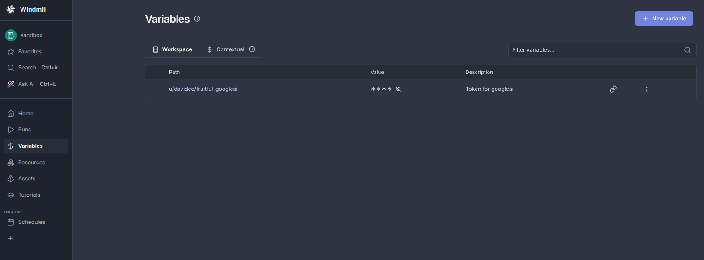

### APIs de ejecución y gestión

El histórico de ejecuciones puede ser consultado mediante el siguiente endpoint en el API de Windmill, si bien la información aportada en la respuesta es bastante limitada.

```bash
curl 'https://localhost/api/w/{workspace}/flows/history/p/{path}' \
  --header 'Authorization: Bearer YOUR_SECRET_TOKEN' 
```

```json
[
  {
    "id": 1,
    "created_at": "2026-03-03T11:20:49.649Z",
    "deployment_msg": "string"
  }
]
```

Las métricas pueden ser accedidas a través de .

```bash
curl 'https://app.windmill.dev/api/w/{workspace}/job_metrics/get/123e4567-e89b-12d3-a456-426614174000' \
  --request POST \
  --header 'Content-Type: application/json' \
  --header 'Authorization: Bearer YOUR_SECRET_TOKEN' \
  --data '{
  "timeseries_max_datapoints": 1,
  "from_timestamp": "",
  "to_timestamp": ""
}'
```

```json
{
  "metrics_metadata": [
    {
      "id": "string",
      "name": "string"
    }
  ],
  "scalar_metrics": [
    {
      "metric_id": "string",
      "value": 1
    }
  ],
  "timeseries_metrics": [
    {
      "metric_id": "string",
      "values": [
        {
          "timestamp": "2026-03-03T11:20:49.649Z",
          "value": 1
        }
      ]
    }
  ]
}
```

### Observabilidad y trazabilidad

En el [siguiente ejemplo](https://youtu.be/CST3qaWNq4g) se muestra la ejecución y montorizació un flujo.

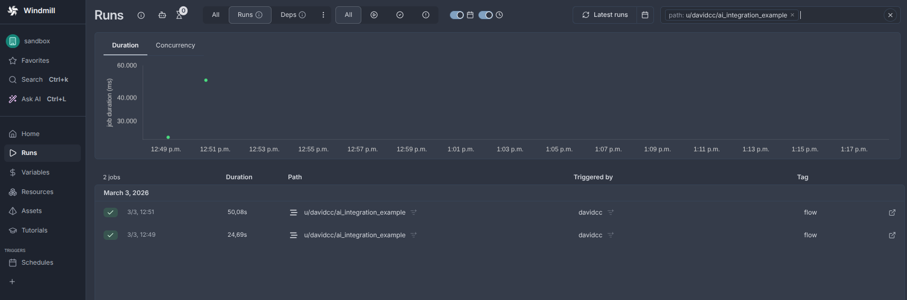

### Listado de operaciones disponibles en el API vinculadas a los dos puntos anteriores.

El elenco de operaciones disponibles resulta demasiado extenso para añadirlo a este documento.


## Información adicional

A continaución se detalla cierta información obtenida tras la realización del despliegue y las pertinentes pruebas. La cual puede ser de interés para una valoración final de la herramienta.

## CLI

Existe un CLI que permite interactuar con las instancias a través de línea de comandos. `[nfo detallada sobre el cli](https://www.windmill.dev/docs/advanced/cli).

## Multi-tenant

La gestión de grupos y directorios se realiza a nivel de instancia, por lo que si fuese necesario que cada tenant tuviese potestad para gestionar gurpos sería necesaria la creación de una instancia independiente. Del mismo modo los roles de usario parecen fijos a tres categorías para la instancia USER, DEVOPS y SUPERADMIN y tres categorías a nivel de workspace USER, DEVELOPER, ADMIN.


## Assests y Resources

A parte de la gestión específica de variables/secretos a nivel de workspace, resulta posible la gestión de assets, elementos empleados para almacenar o ingestar datos en los diversos procesos y recursos, que actúan como conectores con servicios externos que brindando su integración dentro de los flujos de trabajo.

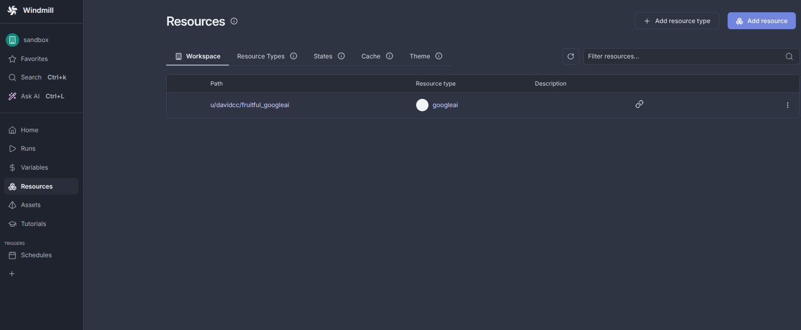

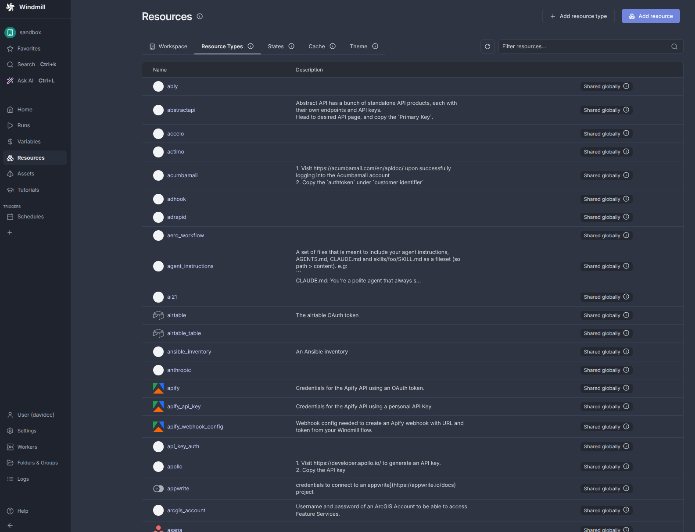

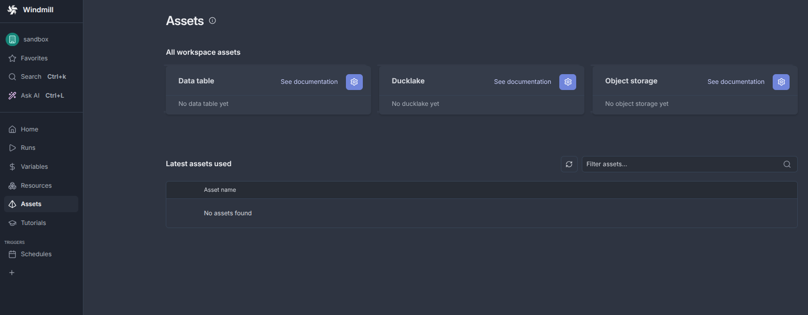

## Métricas y trazas por ejecución

Exsite un apartando dentro del panel de control que permite consultar con detalle el estado de las diversas colas de tareas. En la versión básica dicha característica está limitada a visualizar los workers activos con algunos parámetros como lostrabajos corriendo, porcentaje de ocupación o  uso de meoria entre otros. En el [siguiente video](https://youtu.be/ieHlcVp7ovI) puede verse una pequeña muestra.

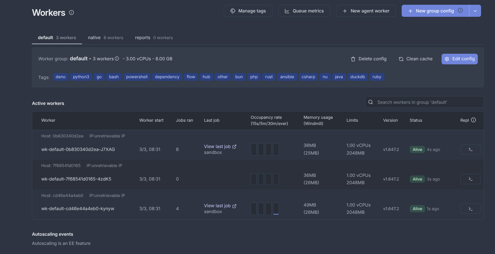

## Gestión de cliclo de vida y versionado

Cada elemento script, flow y App tienen versiones únicas cuando son promocionados a producción, dichas versiones pueden ser consultadas en el histórico de cada elemento. Paralelamente exite un control de versiones vinculado a Git, que posibilita integración contínua de nuevas versiones de scripts, flows y Apps. Esta característica no ha podido ser probada al estar incluída en la versión *entreprise*.

